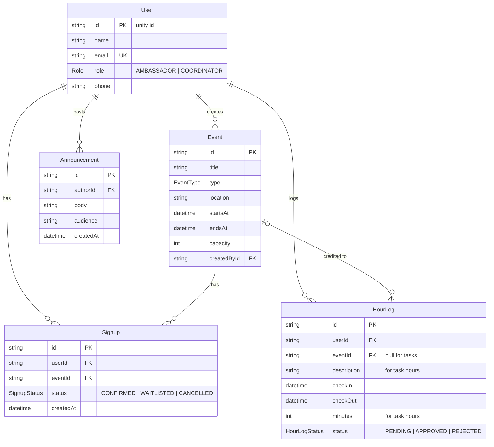

# Ambassador Scheduler

A scheduling tool for NC State CS **student ambassadors** to sign up for events
(campus tours, open houses, info sessions, tabling, panels) and log their hours —
think a focused, role-based version of ConnectTeam built for an ambassador
program.

There are two roles:

- **Ambassador** — browses events, signs up (with a waitlist when full), clocks
  in/out to earn hours, and requests hours for non-event tasks.
- **Coordinator** — creates/edits events, reviews and approves submitted hours,
  posts announcements, and sees program-wide reports.

> Sign-in is passwordless (magic link). See [Authentication](#authentication) below.

## Tech stack

- **[Next.js 16](https://nextjs.org)** (App Router, React 19, Server Components +
  server actions)
- **[Prisma 7](https://www.prisma.io)** ORM over **PostgreSQL** (hosted on
  [Supabase](https://supabase.com))
- **[Supabase Auth](https://supabase.com/docs/guides/auth)** — passwordless magic-link login
- **[Zod](https://zod.dev)** for input validation on event/user create/edit
- **[lucide-react](https://lucide.dev)** icons
- TypeScript throughout

No component library — styling is plain CSS (shared utility classes in
`globals.css` plus a couple of CSS Modules).

## Getting started

### Prerequisites

- Node.js 20+
- A PostgreSQL database (the project is set up for Supabase)

### 1. Install dependencies

```bash
npm install
```

### 2. Configure environment

Copy `.env.example` to `.env` and fill in the values:

```bash
cp .env.example .env
```

- `DATABASE_URL` / `DIRECT_URL` — Supabase Postgres. `DATABASE_URL` is the
  pgbouncer pooler (port 6543, used at runtime); `DIRECT_URL` is the session-mode
  connection (port 5432, used by the Prisma CLI — `prisma.config.ts` reads it).
- `NEXT_PUBLIC_SUPABASE_URL` / `NEXT_PUBLIC_SUPABASE_ANON_KEY` — from the Supabase
  dashboard (Project Settings → API). In Supabase **Auth → URL Configuration**,
  add `http://localhost:3000/auth/callback` (and your deployed URL) as a redirect
  URL, and make sure the email/magic-link provider is enabled.

### 3. Set up the database

```bash
npx prisma migrate deploy   # apply migrations
npm run db:seed             # load demo users, events, signups, hours
```

### 4. Run the app

```bash
npm run dev
```

Open <http://localhost:3000>. You'll be redirected to `/login` — sign in with a
seeded user's email (e.g. `pcoord@ncsu.edu` for a coordinator, `kaheath@ncsu.edu`
for an ambassador) to get the magic link.

## Authentication

Sign-in is passwordless via **Supabase Auth** magic links:

1. Enter your email on `/login` → Supabase emails a one-time link.
2. The link returns to `/auth/callback`, which exchanges it for a session cookie.
3. `middleware.ts` refreshes that session on every request.

Authorization is by **role**, resolved server-side: `getCurrentUser()`
(`src/lib/session.ts`) maps the authenticated email to a `User` row and reads its
`role`. An authenticated email with **no `User` row** is signed in but has no
access — every role guard rejects it (so logins are effectively allow-listed to
seeded/known users). Coordinator-only pages (`/events/new`, `/events/[id]/edit`,
`/approvals`, `/reports`, user management) and all mutating server actions
re-check the role before doing anything.

## Features by page

| Route                 | Who         | What                                                                 |
| --------------------- | ----------- | -------------------------------------------------------------------- |
| `/`                   | Both        | Role-aware dashboard (next shift + hours, or understaffed + pending) |
| `/events`             | Both        | Browse upcoming events; filter by type / "needs ambassadors"         |
| `/events/[id]`        | Both        | Event detail + roster (+ waitlist); coordinator edit/delete          |
| `/events/new`         | Coordinator | Create an event (Zod-validated)                                      |
| `/events/[id]/edit`   | Coordinator | Edit an event (Zod-validated)                                        |
| `/calendar`           | Both        | Month grid; toggle "All events" ↔ "My shifts"                        |
| `/my-shifts`          | Ambassador  | Upcoming + past shifts; cancel (locked 24h before)                   |
| `/time`               | Ambassador  | Clock in/out, request task hours, hours history                      |
| `/approvals`          | Coordinator | Approve/reject submitted hours                                       |
| `/reports`            | Coordinator | Approved hours per ambassador + event coverage                       |
| `/directory`          | Both        | List of ambassadors; coordinator "New user"                          |
| `/directory/[id]`     | Both        | User profile; coordinator edit/delete                                |
| `/directory/new`      | Coordinator | Add a user (Zod-validated)                                           |
| `/directory/[id]/edit`| Coordinator | Edit a user (Zod-validated)                                          |
| `/messages`           | Both        | Announcements feed; coordinators post (audience-targeted)            |
| `/login`              | Public      | Magic-link sign-in                                                   |

### How hours work

Credited hours come from the **clock**, not an event's scheduled length — an
ambassador clocks in on arrival and out when they leave, and the credited time is
`checkOut − checkIn`. Hours can also be requested for non-event **tasks** (e.g.
writing letters to students) with a manual duration. Either kind starts `PENDING`
and a coordinator approves or rejects it.

## Data model

Defined in `prisma/schema.prisma`:

- **User** — `id` (unity id), name, email, `role` (AMBASSADOR | COORDINATOR).
- **Event** — title, type, location, start/end, capacity, description, creator.
- **Signup** — links a user to an event with a status (CONFIRMED | WAITLISTED |
  CANCELLED); unique per (user, event). Confirmed roster is capped at capacity;
  overflow is waitlisted and auto-promoted when a spot frees up.
- **HourLog** — credited time. Either an **event** clock (`eventId` +
  `checkIn`/`checkOut`) or a **task** (`description` + `minutes`); has a status
  (PENDING | APPROVED | REJECTED).
- **Announcement** — coordinator post with an audience (ALL / AMBASSADOR /
  COORDINATOR).



## Project structure

```
middleware.ts            # refreshes the Supabase auth session each request
prisma/
  schema.prisma          # data model
  migrations/            # SQL migration history
  seed.ts                # demo data (npm run db:seed)
src/
  app/
    layout.tsx           # root shell: resolves current user, renders sidebar
    page.tsx             # dashboard (role-aware)
    login/page.tsx       # magic-link sign-in
    auth/callback/route.ts  # exchanges the magic link for a session
    auth/actions.ts      # signOut server action
    <feature>/page.tsx   # one folder per route
    <feature>/actions.ts # "use server" mutations for that feature
    events/schema.ts     # Zod schema for event create/edit
  components/
    Sidebar.tsx / SidebarNav.tsx  # nav (role-gated) + account/logout block
    EventForm.tsx / UserForm.tsx  # shared create/edit forms (useActionState + Zod)
    ConfirmSubmit.tsx    # submit button with a confirm() guard
  lib/
    prisma.ts            # singleton Prisma client
    session.ts           # getCurrentUser(): Supabase session → Prisma User + role
    supabase/server.ts   # server Supabase client (cookies)
    supabase/client.ts   # browser Supabase client
    schemas/user.ts      # Zod schema for user create/edit
    events.ts            # event-type labels/values + badge helpers
    format.ts            # date/time + duration formatting (Eastern time)
```

The app follows one consistent pattern: **pages are Server Components that read
from Prisma directly; mutations are server actions** (`actions.ts`) that write,
then call `revalidatePath` to refresh the affected views.

## Scripts

| Command           | Description                          |
| ----------------- | ------------------------------------ |
| `npm run dev`     | Start the dev server                 |
| `npm run build`   | `prisma generate` + production build |
| `npm start`       | Run the production build             |
| `npm run lint`    | ESLint                               |
| `npm run db:seed` | Reset and reseed demo data           |

Useful Prisma commands: `npx prisma migrate dev` (create a migration in dev),
`npx prisma migrate deploy` (apply migrations), `npx prisma studio` (browse data).

## Roadmap

Remaining work is tracked in the project's GitHub issues. A learning-oriented
reading path through the codebase is in [`REVIEW_GUIDE.md`](./REVIEW_GUIDE.md).
